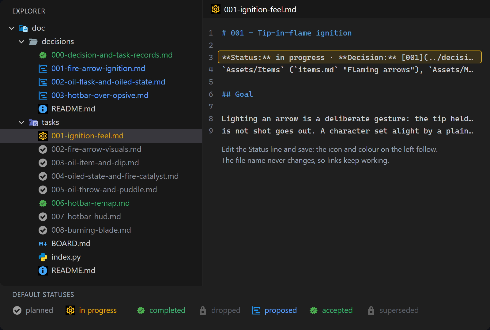

# Record Status

A VS Code extension that shows the status written *inside* a Markdown file — a task, a design
decision, an ADR — on that file in the Explorer, as its icon and the colour of its name. Change the
status line, save, and the Explorer follows. File names never change, so links keep working.



## How it works

- **Name colour (and an optional badge)** use VS Code's file decoration API, the same one git uses
  to mark a file "M". Works with any icon theme.
- **The icon** comes from [Material Icon Theme](https://marketplace.visualstudio.com/items?itemName=PKief.material-icon-theme).
  VS Code gives an extension no way to set another file's icon, but Material Icon Theme builds
  per-file-name icons from its `material-icon-theme.files.customClones` setting. Record Status
  keeps a set of clones named `record-*` in the **workspace** settings (`.vscode/settings.json`),
  one per status, listing the exact files in it. Clones with other names are left alone. Turn this
  off with `recordStatus.icons: false`.

## Install

From a clone of this repo:

```
python install.py
```

then run **Developer: Reload Window**. It copies the extension into `~/.vscode/extensions`; run it
again after pulling an update. For the icons, install Material Icon Theme and make it the active
file icon theme.

## Settings

| Setting | Default | Meaning |
|---|---|---|
| `recordStatus.include` | `doc/tasks/[0-9][0-9][0-9]-*.md`, `doc/decisions/[0-9][0-9][0-9]-*.md` | Globs, relative to the workspace folder, of the files to read. |
| `recordStatus.statusPattern` | `\*\*Status:\*\*\s*([^·\n]+)` | Regex that finds the status; the first group is it. Lower-cased; `"superseded by 004"` reads as `superseded`. |
| `recordStatus.statuses` | planned, in progress, completed, dropped, proposed, accepted, superseded | Per status: `icon` (a Material Icon Theme icon name), `iconColor` (its palette, e.g. `amber-500`, or hex), `nameColor` (a theme colour id), `badge` (up to two characters after the name; none by default). |
| `recordStatus.icons` | `true` | Drive Material Icon Theme's clones. |

Material Icon Theme's palette is spelled `gray-500`, not `grey-500`; a misspelt colour makes it
skip the clone silently.

Example: a front-matter `status: draft` field instead of a bold line:

```json
"recordStatus.include": ["docs/adr/*.md"],
"recordStatus.statusPattern": "^status:\\s*(\\S+)",
"recordStatus.statuses": {
    "draft":    { "icon": "todo",     "iconColor": "gray-500",  "nameColor": "recordStatus.planned" },
    "accepted": { "icon": "verified", "iconColor": "green-500", "nameColor": "recordStatus.completed" }
}
```

The five colour ids `recordStatus.planned`, `.inProgress`, `.completed`, `.dropped` and `.proposed`
can be retuned per theme in `workbench.colorCustomizations`.

## Licence

MIT
