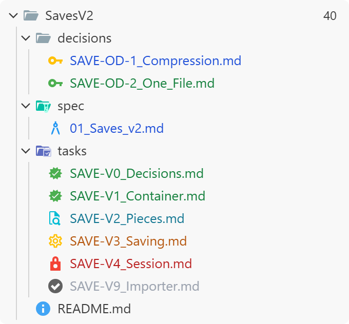

# Record Status

A VS Code extension that shows the status written *inside* a Markdown file — a task, a design
decision, a spec, an ADR — on that file in the Explorer, as its icon and the colour of its name,
and shows on a folder how many of its tasks are done. Change the status line, save, and the
Explorer follows. File names never change, so links keep working.

<a href="https://antvelm.github.io/vscode-record-status/showcase.html">
  <picture>
    <source media="(prefers-color-scheme: dark)" srcset="https://github.com/antvelm/vscode-record-status/raw/HEAD/docs/hero-dark.png">
    
  </picture>
</a>

**[Try the interactive showcase](https://antvelm.github.io/vscode-record-status/showcase.html)**: switch theme and icon
mode, click files to change their status. Every case, with dark and light pictures, is also in
[`docs/showcase.md`](docs/showcase.md).

## Quick start

Write the status as the first word after a bold `**Status:**` line:

```markdown
# SAVE-V1: Container core

**Status:** active
**Needs:** SAVE-V0
```

Put the files in folders named `tasks/`, `decisions/` or `spec/` (anywhere in the workspace), and
they are picked up with no settings at all:

| Kind | Folder | Status words |
|---|---|---|
| Task | `**/tasks/*.md` | `planned` · `active` · `check` (built, waiting for a look) · `done` · `blocked` · `dropped` · `split` |
| Decision | `**/decisions/*.md` | `open` · `decided` · `superseded` · `dropped` |
| Spec | `**/spec/*.md` | `draft` · `review` · `accepted` · `living` (being built) · `superseded` · `explainer` |
| Reference | `**/assessments/*.md` | `research` · `assessment` · `explainer` |

The folder above a `tasks/` folder shows the percentage of its tasks that are done (`✓` at 100%;
`dropped` and `split` tasks don't count). So a folder per feature gets its own progress badge:

```
docs/fire-oil/            ← 40
    spec/fire-oil.md
    decisions/001-….md
    tasks/001-….md
```

On first use, if no status icons can be shown yet, Record Status offers to switch the file icon
theme to **Record Status Icons**, or to use badges only.

## How it works

- **Name colour, tooltip and badges** use VS Code's file decoration API, the same one git uses to
  mark a file "M". They work with any icon theme.
- **The icon.** VS Code gives an extension no way to set another file's icon, so there are
  three ways to get one (`recordStatus.iconMode`):
  - **`bundled`:** Record Status ships its own file icon theme, *Record Status Icons*: every icon
    of [Material Icon Theme](https://github.com/material-extensions/vscode-material-icon-theme)
    (MIT, copied in at build time) plus one recoloured icon per status. The extension rewrites the
    theme's manifest inside its own folder when a status changes, and VS Code reloads it. Nothing
    is written into your workspace.
  - **`material`:** with Material Icon Theme active, Record Status keeps clones named `record-*`
    in `material-icon-theme.files.customClones` in the **workspace** settings. If
    `.vscode/settings.json` is under version control, every status change shows up there.
  - **`badge`:** no icon change; a coloured glyph after the name (`●` active, `◐` check, `✓` done,
    `✗` blocked, `?` open, `·` planned).
  - `auto` (default) picks `bundled` when Record Status Icons is the active icon theme, `material`
    when Material Icon Theme is, and `badge` otherwise.
- **Icons match by file name, not path** (in both icon themes). When files with the same name are
  in different states (several `README.md`, say), that name gets no status icon; its name colour
  still shows the status. **Record Status: Show Log** lists such names.

## Install

**From the Marketplace:** search for **Record Status** in VS Code's Extensions view, or run
`code --install-extension manapotionstudios.record-status`. It is on the
[Visual Studio Marketplace](https://marketplace.visualstudio.com/items?itemName=manapotionstudios.record-status)
and, for VSCodium, Cursor, Windsurf and other editors built on VS Code, on
[Open VSX](https://open-vsx.org/extension/manapotionstudios/record-status).

If you installed an earlier `.vsix` (published as `antvelm.record-status`), uninstall it first:
`code --uninstall-extension antvelm.record-status`. Settings carry over.

**From a `.vsix`:** in VS Code, open the Extensions view, then **…** → **Install from VSIX…** and
pick `record-status-<version>.vsix`, or run `code --install-extension record-status-<version>.vsix`.
It then shows in the Extensions view like any other extension and can be disabled or uninstalled
there.

**From a clone of this repo** (needs Node.js and VS Code's `code` command on PATH):

```
python install.py            # build the .vsix and install it
python install.py --package  # only build the .vsix
```

then run **Developer: Reload Window**. Run it again after pulling an update.

## Agent skill

[`skills/record-status/SKILL.md`](skills/record-status/SKILL.md) teaches a coding agent (Claude
Code, or any agent that reads Agent Skills) to write records in this layout: the folders, file
names, the status line, what each status word means, and which ones only a person should set (an
agent finishes a task as `check`, never `done`). To use it, copy the `skills/record-status` folder
into `~/.claude/skills/` for every project, or into a project's `.claude/skills/` to share it with
everyone on that project. A project's own rules (`AGENTS.md`, its own records skill) take
precedence over it. It is not part of the `.vsix`.

## Settings

| Setting | Default | Meaning |
|---|---|---|
| `recordStatus.profiles` | built-in `task`, `decision`, `spec`, `reference` | Kinds of record, in order; the first whose `include` globs match a file owns it. Each has `include`, an optional `statusPattern`, and `statuses` (word → look). A profile named like a built-in one inherits the built-in `include` and `statuses` it doesn't set. |
| `recordStatus.statusPattern` | `\*\*Status:\*\*\s*([A-Za-z-]+)` | Regex that finds the status; the first group is it. Lower-cased; `"superseded by 004"` reads as `superseded`. |
| `recordStatus.iconMode` | `auto` | `auto`, `bundled`, `material`, `badge` or `off` (see above). |
| `recordStatus.colorPreset` | `git` | Name colours: `git` (git's Explorer colours), `classic` (Record Status's own), `soft` (classic, lower contrast), `theme` (the colour theme's chart colours), `quiet` (only what needs attention), `monochrome` (shades of grey, icons included; with Material Icon Theme also set `material-icon-theme.saturation` to 0), `dark` (deeper, muted colours), `none`. |
| `recordStatus.colors` | `{}` | Per-slot overrides on top of the preset: slot (`planned`, `inProgress`, `check`, `completed`, `blocked`, `living`, `dropped`, `proposed`) → theme colour id, or `""` for none. |
| `recordStatus.rollup` | on, tasks | `enabled`, `profiles` (whose records count; `["task"]`), `folders` (globs of folders that get a badge; empty: the folder above each record's folder), `nameColor` (folder name at 100%). |

A look (one entry of `statuses`) has `icon` (a Material Icon Theme icon name), `iconColor` (a
Material palette name such as `amber-500`, or hex), `nameColor` (a theme colour id), `badge`
(up to two characters, always shown), `glyph` (up to two characters, shown in badge mode) and
`rollup` (`"done"` counts as done, `"skip"` is not counted).

Example: your own folders for tasks, and ADRs with a front-matter `status: draft` field:

```jsonc
"recordStatus.profiles": {
    "task": { "include": ["planning/*.md"] },          // built-in task words
    "adr": {
        "include": ["docs/adr/*.md"],
        "statusPattern": "^status:\\s*(\\S+)",
        "statuses": {
            "draft":    { "icon": "todo",     "iconColor": "gray-500",  "nameColor": "recordStatus.planned",   "glyph": "·" },
            "accepted": { "icon": "verified", "iconColor": "green-500", "nameColor": "recordStatus.completed", "glyph": "✓" }
        }
    }
}
```

**Record Status: Configure…** adds folders to a profile without editing JSON.

The 0.2 settings `recordStatus.include` and `recordStatus.statuses` still work, as one profile,
while `profiles` is empty; `recordStatus.icons: false` means `iconMode: "off"`.

Colours: a look's `nameColor` names a slot (`recordStatus.completed`); `colorPreset` and
`colors` decide which theme colour that slot uses. For an exact hex value, keep the slot on its
`recordStatus.*` id and set it in `workbench.colorCustomizations`:

```jsonc
"recordStatus.colors": { "planned": "", "completed": "charts.green" },
"workbench.colorCustomizations": { "recordStatus.inProgress": "#ff9900" }
```

The colour ids `recordStatus.planned`, `.inProgress`, `.check`, `.completed`, `.blocked`,
`.living`, `.dropped` and `.proposed` can be retuned per theme in `workbench.colorCustomizations`.

## Development

`npm install` (once; fetches the pinned `material-icon-theme` the bundled theme is built from),
`npm test` (plain Node tests of `core.js`), `npm run build-theme` (rebuilds `theme/`; `vsce
package` runs it too), `npm run showcase` (after `build-theme`: regenerates `docs/showcase.md`,
`docs/showcase.html`, their images and the README pictures `docs/hero-*.png`; needs Chrome or
Edge for the PNGs). After changing a look, regenerate and commit the showcase with it.

## Licence

MIT, © Mana Potion Studios UG (haftungsbeschränkt). The bundled icons are from Material Icon Theme, MIT, © Material Extensions; their licence
ships in `theme/MATERIAL-LICENSE.txt`.
