# Record Status: design showcase

Every case the extension draws in the Explorer, generated from the extension's own data
(`core.js` built-in profiles, the bundled icon theme, `package.json` colours) by
`npm run showcase`. Regenerate it after changing a look, then review the diff.

Each picture is a mock-up of the Explorer at VS Code's sizes (22 px rows, 16 px icons), dark
and light. Icons are Material Icon Theme 5.39's, recoloured the way the bundled theme
recolours them. Text uses the system UI font, so it can differ slightly from VS Code's.

**Interactive version:** [`showcase.html`](showcase.html) (open it in a browser; switch theme and icon
mode, click files to change their status).

**Contents:** [1. Status words](#1-status-words) · [2. Icon modes](#2-icon-modes) ·
[3. Folder roll-up](#3-folder-roll-up) · [4. Shared file names](#4-shared-file-names) ·
[5. Tooltip](#5-tooltip) · [6. Questions to approve](#6-questions-to-approve)

## 1. Status words

The four built-in kinds. Shape = kind, colour = state. Icon mode `bundled` (the same pictures
as `material`).

### Task — `**/tasks/*.md`

| Dark | Light |
|---|---|
| 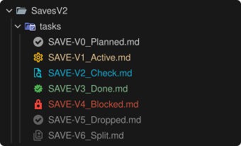 | 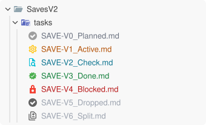 |

| Icon | Word | Meaning | Icon (Material name, colour) | Name colour dark / light | Glyph (badge mode) | Roll-up |
|---|---|---|---|---|---|---|
|  | `planned` | Not started. | `todo`, `gray-500` |  `#8a8f98` / 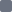 `#6b7280` | `·` | counted |
|  | `active` | Being worked on. | `settings`, `amber-500` |  `#e0a800` /  `#b45309` | `●` | counted |
|  | `check` | Built; waiting for a person's look. Never blocks. | `search`, `cyan-500` |  `#22b8cf` /  `#0e7490` | `◐` | counted |
|  | `done` | Finished; counts as done in the roll-up. | `verified`, `green-500` |  `#3cb371` /  `#15803d` | `✓` | done |
|  | `blocked` | Can't start or continue; **Open:** says why. | `lock`, `red-500` |  `#f0605d` /  `#b91c1c` | `✗` | counted |
|  | `dropped` | Won't be done; not counted in the roll-up. | `todo`, `gray-700` |  `#5a5f66` /  `#9ca3af` | `–` | not counted |
|  | `split` | Points to other tasks; not counted. | `diff`, `gray-700` |  `#5a5f66` /  `#9ca3af` | `→` | not counted |

### Decision — `**/decisions/*.md`

| Dark | Light |
|---|---|
| 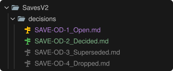 | 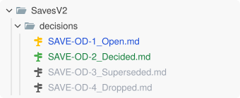 |

| Icon | Word | Meaning | Icon (Material name, colour) | Name colour dark / light | Glyph (badge mode) | Roll-up |
|---|---|---|---|---|---|---|
|  | `open` | Asked or to be asked. | `key`, `amber-500` |  `#5aa0ff` /  `#1d4ed8` | `?` | — |
|  | `decided` | Answered; the spec is updated. | `key`, `green-500` |  `#3cb371` /  `#15803d` | `✓` | — |
|  | `superseded` | Replaced by a later decision. | `key`, `gray-700` |  `#5a5f66` /  `#9ca3af` | `–` | — |
|  | `dropped` | No longer relevant. | `key`, `gray-700` |  `#5a5f66` /  `#9ca3af` | `–` | — |

### Spec — `**/spec/*.md`

| Dark | Light |
|---|---|
| 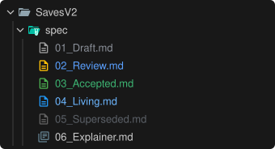 | 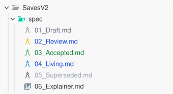 |

| Icon | Word | Meaning | Icon (Material name, colour) | Name colour dark / light | Glyph (badge mode) | Roll-up |
|---|---|---|---|---|---|---|
|  | `draft` | Being written. | `document`, `gray-500` |  `#8a8f98` /  `#6b7280` | `·` | — |
|  | `review` | Ready for the developer to read. | `document`, `amber-500` |  `#5aa0ff` /  `#1d4ed8` | `?` | — |
|  | `accepted` | Signed off, not built yet. | `document`, `green-500` |  `#3cb371` /  `#15803d` | `✓` | — |
|  | `living` | Being built; kept current. | `document`, `blue-500` |  `#6cb6ff` /  `#1d4ed8` | `●` | — |
|  | `superseded` | Replaced. | `document`, `gray-700` |  `#5a5f66` /  `#9ca3af` | `–` | — |
|  | `explainer` | Explains part of another spec. | `instructions`, `blue-gray-500` | — | — | — |

### Reference — `**/assessments/*.md`

| Dark | Light |
|---|---|
| 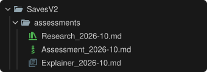 | 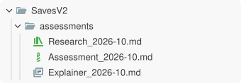 |

| Icon | Word | Meaning | Icon (Material name, colour) | Name colour dark / light | Glyph (badge mode) | Roll-up |
|---|---|---|---|---|---|---|
|  | `research` | v1 research, read-only. | `bibliography`, `green-500` | — | — | — |
|  | `assessment` | A dated assessment. | `lighthouse`, `green-500` | — | — | — |
|  | `explainer` | An explainer. | `instructions`, `blue-gray-500` | — | — | — |

## 2. Icon modes

One folder in each `recordStatus.iconMode`. Roll-up and name colours are the same in every mode.

### `bundled` — Record Status Icons is the file icon theme

Status icons, name colours. Writes nothing into the workspace.

| Dark | Light |
|---|---|
|  | 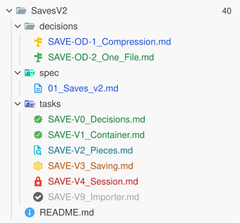 |

### `material` — Material Icon Theme is the file icon theme

Looks the same as `bundled`, but the icons come from `record-*` clones written into the
workspace's `.vscode/settings.json` on every status change.

### `badge` — any icon theme

Files keep their theme icon (here Material's Markdown icon); a glyph after the name carries
the status, in the name colour.

| Dark | Light |
|---|---|
| 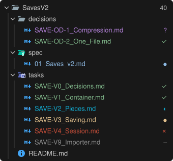 | 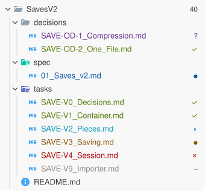 |

### `off`

Name colour only.

| Dark | Light |
|---|---|
| 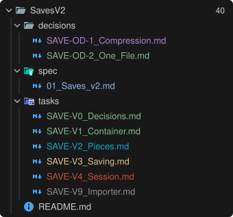 | 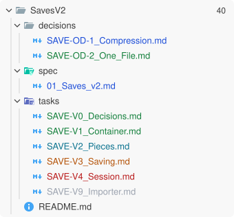 |

### Name colours: `recordStatus.colorPreset`

The same folder with each preset. `default` is Record Status's own colours. `theme` and
`git` borrow colours from the active colour theme, so they change with it (shown here as
VS Code's Dark and Light Modern draw them). `recordStatus.colors` overrides single slots, and
`workbench.colorCustomizations` sets exact hex values for the `recordStatus.*` ids.

#### `default`

| Dark | Light |
|---|---|
| 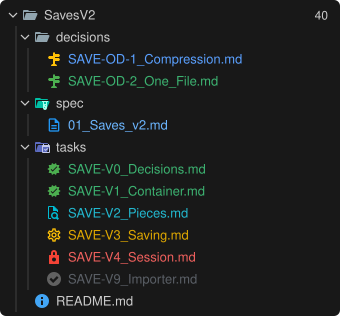 | 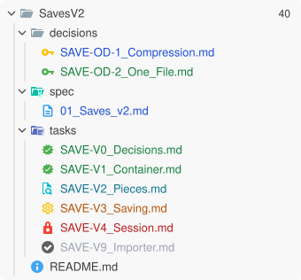 |

#### `theme`

| Dark | Light |
|---|---|
| 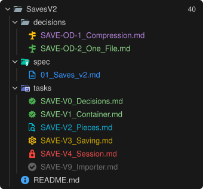 | 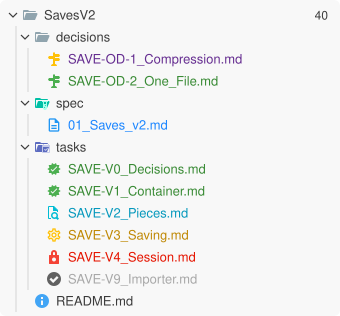 |

#### `git`

| Dark | Light |
|---|---|
| 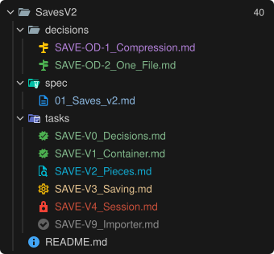 | 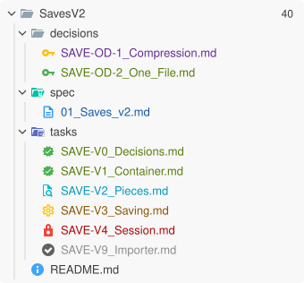 |

#### `quiet`

| Dark | Light |
|---|---|
| 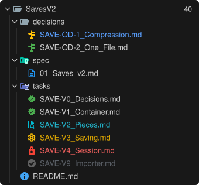 | 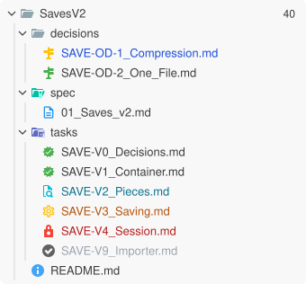 |

#### `none`

| Dark | Light |
|---|---|
| 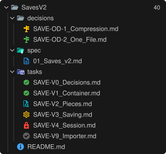 | 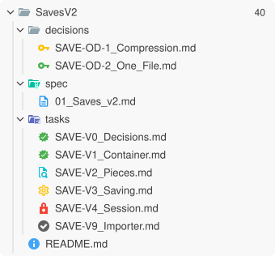 |

## 3. Folder roll-up

The folder above a `tasks/` folder shows the share of its tasks that are done: `0`…`99`,
then `✓` with a green name at 100%. `dropped` and `split` tasks are not counted.

| Dark | Light |
|---|---|
| 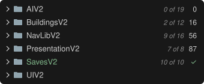 | 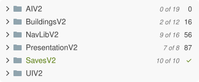 |

`UIV2` has no `tasks/` folder yet, so no badge. The grey note is not drawn by VS Code; it is the tooltip text.

## 4. Shared file names

Icon themes match by file name, not path. When files with the same name are in different
states, the name gets no status icon and keeps the theme's own; its name colour still shows the
status. Below: the two `README.md` files are `review` and `living` specs, so both keep the
README icon. The two `02_Build_Order.md` are both `living`, so they keep the status icon.

| Dark | Light |
|---|---|
| 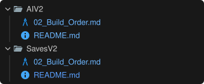 | 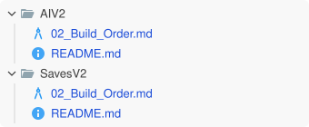 |

## 5. Tooltip

Hovering a record names its kind and status; hovering a roll-up folder gives the count.

| Dark | Light |
|---|---|
| 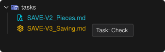 | 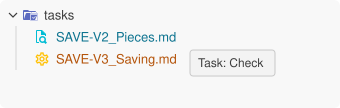 |

## 6. Questions to approve

1. **Decision icon:** a key now. Alternatives on the [interactive page](showcase.html)
   (Decision icon picker): `routing` (a signpost: "which way?"), `git` (a fork),
   `chess`, `tune`, `label`, `certificate`, `pipeline`.
2. **Spec icon:** now `document` (a page with lines of text). Alternatives on the page:
   `log`, `contributing`, `toc`, `architecture` (the old one).
3. **Default colour preset:** `default`, or one of `theme`, `git`, `quiet`, `none`?
4. **Shapes per kind:** tasks use a different shape per state (todo, gear, magnifier, verified,
   lock); decisions and specs keep one shape. Keep, or give tasks one shape too?
5. **`check` in cyan with a magnifier:** distinct enough from `active` (amber gear)?
6. **`dropped` reuses the grey todo icon** and `split` the diff icon, both dark grey. Fine,
   or should `dropped` get its own shape?
7. **Name colours:** open decisions and specs in review are *blue* names with *amber* icons.
   Make the name amber too, or keep blue for "waiting on someone"?
8. **Glyphs in badge mode:** `·` for planned and draft is very small. Use `○` instead?
9. **Roll-up at 100%:** `✓` and a green folder name. Keep the green name?
